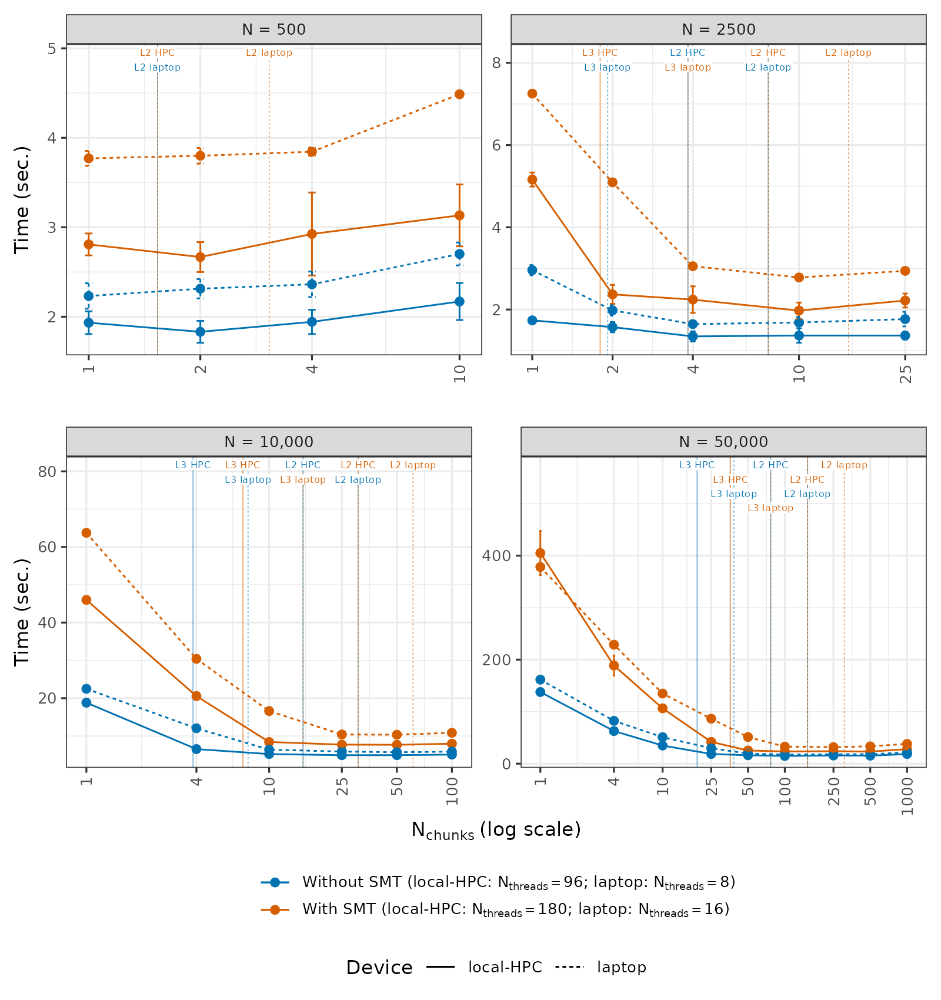
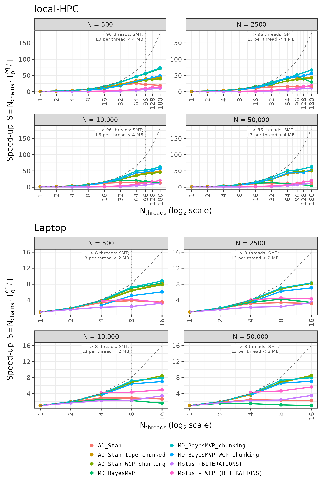

<!-- ------------------------------------------------------------------------------------------------------------------------------- -->
# Cache-aware chunking dramatically improves parallel scaling for HMC with autodiff and manual gradients: Application to multivariate probit model in Stan and NicoStan/BayesMVP
<!-- ------------------------------------------------------------------------------------------------------------------------------- -->

Enzo Cerullo¹, Olivia Carter², Hayley E Jones³, Tim Lucas¹, Nicola J. Cooper¹, Alex J. Sutton¹

¹ Biostatistics Research Group, Division of Public Health & Epidemiology, School of Medical Sciences, University of Leicester, Leicester, UK

² Queen's Veterinary School Hospital, Cambridge, University of Cambridge, UK

³ Population Health Sciences, Bristol Medical School, University of Bristol, UK

[Abstract](#abstract) ·
[Key results](#key-results) ·
[Repository contents](#repository-contents) ·
[Reproducing the results](#reproducing-the-results) ·
[Related software](#related-software) ·
[How to cite](#how-to-cite)


<!-- ------------------------------------------------------------------------------------------------------------------------------- -->
## Abstract
<!-- ------------------------------------------------------------------------------------------------------------------------------- -->

We show that cache-aware chunking - a technique used in high-performance computing, but novel in the context of MCMC sampling - can yield large improvements in parallel scaling.
Applied to the LC-MVP model implemented in NicoStan+BayesMVP, on a 96-core server, chunking was up to ~17.5× faster, and on a consumer laptop it was up to ~11.9× faster, with the optimal chunk count depending on dataset size and the allocation of threads.

These gains are due to a shift in the computational bottleneck: without chunking, the `lp_grad()` evaluation is memory-bandwidth-bound, leaving no room for additional threads to contribute.
With chunking, more of the data fits within the L2/L3 caches, shifting the computation to a more compute-bound regime.
This has an important consequence for simultaneous multithreading (SMT): HMC workloads typically see no benefit - or even degradation - from SMT, whereas chunked NicoStan+BayesMVP achieved SMT efficiency gains of ~20% - 29% on a 96-core AMD server CPU (AMD EPYC 9654), and ~9% - 22% on an 8-core laptop (AMD Ryzen 5800H) - both without 3D V-Cache.

Our results suggested three computational profiles - bandwidth-bound (plain Stan, and NicoStan+BayesMVP without chunking), compute-bound (NicoStan+BayesMVP with chunking), and latency-bound (Mplus) - with predictable consequences for parallel scaling and SMT behaviour.

These parallel scaling results should be interpreted alongside raw efficiency: NicoStan+BayesMVP with chunking is approximately [TBD]× and [TBD]× faster than Mplus and Stan, respectively, in time to achieve a target ESS (at N = 10,000; final values to follow).

Looking ahead, CPUs with larger L3 caches - such as AMD's 3D V-Cache line - would likely amplify these benefits.
Furthermore, tape chunking improved the parallel scaling of the Stan model in this study; similar strategies applied to the Stan math C++ library may improve parallel scaling for general Stan models.

The full BayesMVP algorithm and benchmarks, and acceleration of arbitrary Stan models via NicoStan (with preliminary speed-ups of ~1.5-15×), will be described in two upcoming papers.


<!-- ------------------------------------------------------------------------------------------------------------------------------- -->
## Key results
<!-- ------------------------------------------------------------------------------------------------------------------------------- -->



*Figure 1: Mean NicoStan+BayesMVP sampling time (seconds) against the number of chunks (log scale), for N = 500, 2,500, 10,000 and 50,000. Direct comparison of HPC (solid lines) and laptop (dashed lines), without SMT (HPC: 96 threads, laptop: 8 threads; blue lines) and with SMT (HPC: 180 threads, laptop: 16 threads; orange lines), with error bars showing the standard deviation across 4 runs. The vertical lines show the number of chunks at which one chunk (1,608 bytes per individual) first fits within the L3 or L2 cache per active thread, in the colour and line type of the corresponding data line; to the left of an L3 line, one chunk no longer fits within the L3 cache per active thread.*



*Figure 2: Normalised parallel scaling for each algorithm, computed as: (N_chains/second) × T_0, where T_0 is the time of each algorithm's own one-chain, one-thread reference at the same number of iterations (for WCP, the corresponding implementation without WCP); i.e., the speed-up over the one-chain, one-thread reference, as defined in the paper (with the same reference as the paper's parallel efficiency tables). Note: this normalisation removes absolute speed differences between algorithms, allowing direct comparison of how well each algorithm's performance scales with additional threads, but relative to its own baseline. Top half: HPC (1-180 threads; WCP allocations from 8 up to 128 or 176 threads). Bottom half: Laptop (1-16 threads; WCP allocations from 4 threads). Higher values indicate greater throughput. The dashed grey line shows perfect linear scaling (i.e., speed-up = number of threads). The dotted vertical lines mark 96 threads (HPC) and 8 threads (laptop), above which SMT is used. Note: these results reflect parallelisation behaviour only, and do not account for differences in effective sample size (ESS) per second between algorithms; a method that scales perfectly here may still require more total computation to achieve equivalent posterior precision.*


<!-- ------------------------------------------------------------------------------------------------------------------------------- -->
## Repository contents
<!-- ------------------------------------------------------------------------------------------------------------------------------- -->

| Folder | Contents |
| --- | --- |
| `paper_1_chunking_and_parallel_scalability/` | The R scripts for the benchmarks, figures and tables (see [Reproducing the results](#reproducing-the-results)), the Stan models (`stan_models/`: the unpartitioned model, `LC_MVP_bin_PartialLog_v5.stan`; the chunked model used for the Stan + chunking configurations, `LC_MVP_bin_PartialLog_v5_chunked.stan`; and the model used for the Stan tape-chunking and WCP configurations, `LC_MVP_bin_PartialLog_v5_reduce_sum_static.stan`), and the saved study summaries (`paper_1_computational_outputs/`, `burnin_outputs/`) |
| `paper_1_chunking_and_parallel_scalability/mechanism_study/` | The counter programs (C), run scripts, case lists, and the measured counts and times for the hardware-counter profiling study (Experiment 4) |
| `paper_1_chunking_and_parallel_scalability/working_set/` | The working set of one gradient evaluation per individual behind the cache-capacity lines and the automatic chunking rule: the array count for NicoStan+BayesMVP (1,608 bytes) and the probe harness which measured the Stan model's autodiff tape (19,152 bytes), with its raw output |
| `0_utilities/` | Shared R functions, including the simulation of the COVID-19-based LC-MVP datasets and the Stan compilation settings |
| `1_appendix_pilot_studies/` | The Mplus and Stan pilot-study results, and the NicoStan+BayesMVP pilot-study functions, used for the absolute efficiency comparison (Experiment 3) |
| `results/data/` | CSV files with every measured configuration (e.g., `measured_cases.csv`, `configurations.csv`, `scaling.csv`, `wcp_chunk_search.csv`) |
| `results/figures/`, `results/tables/` | The figures and tables in the paper and its supplementary material |


<!-- ------------------------------------------------------------------------------------------------------------------------------- -->
## Reproducing the results
<!-- ------------------------------------------------------------------------------------------------------------------------------- -->

The benchmarks are run from R, using our R packages [NicoStan](https://github.com/CerulloE1996/NicoStan) and [BayesMVP](https://github.com/CerulloE1996/BayesMVP) (see their installation instructions), as well as [BridgeStan](https://roualdes.us/bridgestan/latest/) and [cmdstanr](https://mc-stan.org/cmdstanr/).
The Mplus comparisons also require [Mplus](https://www.statmodel.com/) (commercial software) and the MplusAutomation R package.
The other R packages used are listed in `0_utilities/shared_configs/load_R_packages.R`.

The folders in this repository follow the same structure as our analysis folder; hence, to run the scripts, set `algorithm_study_dir` (and the other paths at the top of each script) to the location of this repository on your computer.
Note that the Stan models were compiled with the AMD AOCC compiler on Linux; the compiler paths and flags are set in `R_fns_alg_paper_1_chunking_WCP_par_scaling.R`.

| Script | What it does |
| --- | --- |
| `alg_paper_1_chunking_WCP_par_scaling.R` | The main sampling benchmark: chunking, WCP and parallel scaling for NicoStan+BayesMVP, the Stan model (via NicoStan) and Mplus, for N = 500, 2,500, 10,000 and 50,000, on the HPC and the laptop |
| `alg_paper_1_figures_tables.R` | The figures and tables, from the saved study summaries (no sampling) |
| `ps_1_burnin_optimizing_N_chunks_and_WCP_threads.R` | The burn-in benchmark (number of chunks and WCP threads for NicoStan+BayesMVP's burn-in) |
| `alg_paper_1_burnin_report.R` | The burn-in figures and tables, from the saved burn-in results |
| `alg_paper_1_experiment_3_table.R` | The absolute efficiency table (time to a target ESS for NicoStan+BayesMVP, Stan and Mplus), from the pilot-study results |
| `mechanism_study/run_mechanism_experiments.sh`, `mechanism_study/analyse_mechanism_study.R`, `mechanism_study/make_paper_figure_exp4.R` | The hardware-counter profiling study (Experiment 4): the counter runs, their summaries, and the DRAM bandwidth figure |
| `working_set/stan/build_and_run.sh` | The Stan working-set measurement (stanc, the probe patch, the build, the runs and the fit); `working_set/README.md` derives both working sets |

Note that the complete saved run outputs are not included here because of their size (over 200 GB).
Hence, `alg_paper_1_experiment_3_table.R` also needs the saved outputs of our NicoStan+BayesMVP pilot study (or a re-run of that study) for its NicoStan+BayesMVP rows.


<!-- ------------------------------------------------------------------------------------------------------------------------------- -->
## Linux commands for hardware-counter profiling
<!-- ------------------------------------------------------------------------------------------------------------------------------- -->

This section lists the commands which we ran from a Linux terminal (i.e., the Bash command line) for the hardware-counter profiling in Experiment 4 (see the paper for the design and the results), on both the local-HPC and the laptop.
In the listings, text after a `#` is a comment (i.e., it is not run), and a `\` at the end of a line means that the command continues on the next line.
A file's extension shows its type: `.c` is C source code, `.R` an R script, `.py` a Python script, `.sh` a shell script, and `.csv` a plain-text table.
The programs and scripts named below are in `paper_1_chunking_and_parallel_scalability/mechanism_study/`.

Both machines run Pop!_OS 22.04 (with Linux kernel 6.12 on the local-HPC, and 6.5 on the laptop), and all programs below were compiled using GCC 11.4.
The counters were read via the Linux kernel's `perf_event_open` interface (rather than the `perf` tool), by two small C programs (`pmc_stat` and `umc_stat`).
More specifically, `pmc_stat` runs a command and records the CPU's own hardware counters for every thread of that command (user space only), whereas `umc_stat` records the DRAM traffic at the memory controllers of the whole machine (local-HPC only).
Both programs append the running totals of the counters to a CSV file whenever they receive the `SIGUSR1` signal (i.e., a short message from another running program, telling it to act immediately), which we sent around each sampling call.

### Checking the CPU topology and the available counters

On each machine, we first checked the CPU and its caches, which logical CPUs share a physical core (SMT) and an L3 cache (i.e., a CCX; one per CCD on the local-HPC), and which counters the kernel exposes:

```bash
lscpu | grep -E "Model name|Thread|Core|Socket|L2 cache|L3 cache|NUMA node"
free -g
cat /sys/devices/system/cpu/cpu*/topology/thread_siblings_list | sort -u
cat /sys/devices/system/cpu/cpu*/cache/index3/shared_cpu_list | sort -u
cat /proc/sys/kernel/perf_event_paranoid
ls /sys/bus/event_source/devices/
```

Here, `lscpu` lists the details of the CPU, `free -g` shows the amount of RAM (in GiB), `cat` prints the contents of a file, and `ls` lists the contents of a folder; the files under `/sys` and `/proc` are where the Linux kernel reports the hardware details and settings.
On the local-HPC, logical CPUs k and k + 96 are the two SMT threads of the same physical core, and each CCD consists of 8 consecutive physical cores (i.e., CPUs 0-7 and 96-103 share one L3 cache, CPUs 8-15 and 104-111 share the next, and so on).
On the laptop, CPUs 2k and 2k + 1 are the two SMT threads of the same physical core, and all 16 CPUs share the one L3 cache.
The layout of each CPU is shown in the CPU topology figures in the paper, in which each thread is labelled with its logical CPU number.

Furthermore, on the local-HPC, we checked the memory type, and the encoding of the memory-controller counters (which are only listed once the AMD uncore driver has been loaded; see [Enabling the counters](#enabling-the-counters)):

```bash
cat /sys/devices/system/edac/mc/mc0/rank0/dimm_mem_type        # Registered-DDR5
cat /sys/bus/event_source/devices/amd_umc_0/type
cat /sys/bus/event_source/devices/amd_umc_0/format/event       # config:0-7
cat /sys/bus/event_source/devices/amd_umc_0/format/rdwrmask    # config:8-9
```

### Enabling the counters

The per-process counters used by `pmc_stat` can be read without root access under the default kernel setting (`kernel.perf_event_paranoid = 2`).
However, the memory-controller counters are system-wide; hence, `umc_stat` requires the AMD uncore driver to be loaded, and this setting to be lowered to 0 or below.
Therefore, we ran the following on both machines before the profiling (these commands only last until the machine is restarted):

```bash
sudo modprobe amd_uncore
sudo sysctl kernel.perf_event_paranoid=-1
```

Here, `sudo` runs a command with administrator (i.e., root) rights, `modprobe` loads a kernel module (i.e., a driver), and `sysctl` changes a kernel setting.
After the profiling, the default setting can be restored using:

```bash
sudo sysctl kernel.perf_event_paranoid=2
```

### Counter events

`pmc_stat` records six events, one for each core counter on these AMD CPUs; hence, the events did not need to be multiplexed:

- (i) CPU cycles and instructions, using the kernel's generic hardware events (`PERF_COUNT_HW_CPU_CYCLES` and `PERF_COUNT_HW_INSTRUCTIONS`).
- (ii) L1 data-cache fills by where the data came from, using AMD event `PMCx044` (Zen 3 and Zen 4), as the raw events: `0x0144` (the core's own L2 cache); `0x0244` (the L3 cache of the same CCX, or the L2 cache of another core in the same CCX; i.e., the same CCD on the local-HPC); `0x1444` (a cache in another CCX, i.e., another CCD on the local-HPC); and `0x4844` (DRAM or I/O).

`umc_stat` opens event `0x0a` (CAS commands) on each of the 12 memory-controller counters of the local-HPC (`amd_umc_0` to `amd_umc_11`), with `rdwrmask` set to 1 for reads (`config = 0x10a`) and to 2 for writes (`config = 0x20a`).
Each CAS command transfers one 64-byte cache line; hence, the DRAM traffic (in bytes) is 64 times the number of CAS commands, summed over the 12 memory controllers.

### Building and calibrating the counter programs

The counter and calibration programs were compiled using:

```bash
gcc -O2 -Wall -o pmc_stat pmc_stat.c                            # laptop: without -Wall
gcc -O2 -Wall -o umc_stat umc_stat.c                            # local-HPC only
gcc -O2 -o calibrate_cache_levels calibrate_cache_levels.c
gcc -O2 -o stream_read stream_read.c                            # local-HPC only
```

Here, `gcc` is the GNU C compiler, which turns each C source file into a runnable program; `-O2` turns on the compiler's standard optimisations, `-Wall` turns on its warnings, and `-o` gives the name of the resulting program.

Before the profiling, we checked that the counters attribute memory accesses to the expected level of the memory hierarchy.
More specifically, `calibrate_cache_levels` follows a random chain of pointers through a working set of a given size (so that each access depends on the previous one, and hence cannot be prefetched), and `stream_read` fills a 1 GiB array and then reads it sequentially, five times.
The working sets were chosen to fit within the L2 cache, fit within the L3 cache, or exceed the L3 cache available to a single core (256 MiB; although the local-HPC has 384 MB of L3 cache in total, a single core only uses the 32 MB L3 cache of its own CCD), and the `sleep` runs measure the background DRAM traffic from other programs.
On the local-HPC:

```bash
for kib in 256 8192 262144; do
    taskset -c 5 ./pmc_stat cal_HPC.csv ws_${kib}KiB -- \
        ./calibrate_cache_levels $kib 20000000 > /dev/null
done
./umc_stat cal_umc.csv chase_256MiB -- ./calibrate_cache_levels 262144 20000000 > /dev/null
./umc_stat cal_umc.csv idle_3s -- sleep 3
./umc_stat umc_cal2.csv stream_1GiB_x5 -- ./stream_read > /dev/null
./umc_stat umc_cal2.csv idle_2s -- sleep 2
```

and on the laptop:

```bash
for kib in 128 2048 8192 262144; do
    ./pmc_stat cal.csv ws_${kib}KiB -- ./calibrate_cache_levels $kib 20000000 > /dev/null
done
```

Here, `./` runs a program from the current folder, `taskset -c 5` runs a program on CPU 5 only (i.e., it pins the program to that CPU), `> /dev/null` discards the program's printed output, and `for ... do ... done` repeats the command for each working-set size.

### Running the profiling cases

The cases for designs (i)-(iv) of Experiment 4 were written to one CSV file per machine (128 cases on the local-HPC, and 85 on the laptop) using:

```bash
python3 make_mechanism_cases.py HPC        # writes cases_HPC.csv
python3 make_mechanism_cases.py Laptop     # writes cases_Laptop.csv
```

and the 28 DRAM-traffic cases of design (i) were written to `cases_HPC_E5.csv`.
Each list was then run using `run_mechanism_experiments.sh`:

```bash
nohup setsid bash run_mechanism_experiments.sh HPC > /dev/null 2>&1 < /dev/null &
nohup setsid bash run_mechanism_experiments.sh Laptop > /dev/null 2>&1 < /dev/null &
## local-HPC: re-run of any incomplete cases, followed by the DRAM-traffic cases of design (i):
nohup setsid bash -c 'bash run_mechanism_experiments.sh HPC;
    bash run_mechanism_experiments.sh HPC cases_HPC_E5.csv umc' \
    > /dev/null 2>&1 < /dev/null &
```

Here, `python3` and `bash` run a Python script and a shell script, respectively; `nohup` and `setsid` keep the script running after the terminal is closed, `&` runs it in the background, and `> /dev/null 2>&1 < /dev/null` detaches it from the terminal (its progress is written to log files instead).
This script skips any completed case; hence, failed cases were re-run by calling it again (as in the last command above).

For every case, this script runs the following command, which starts a fresh R session under `pmc_stat` and runs the case via `mechanism_case.R` (with the values in angle brackets taken from the case list):

```bash
MECH_ALGORITHM=<algorithm> MECH_N=<N> MECH_CHUNKS=<N_chunks> \
MECH_CHAINS=<N_chains> MECH_THREADS_PER_CHAIN=<N_threads_per_chain> \
MECH_N_ITER=<n_iter> MECH_N_ITER_SHORT=2 MECH_SEED=1000 MECH_LABEL=<label> \
MECH_RESULTS_FILE=mechanism_times_<device>.csv OMP_NUM_THREADS=1 \
    timeout 3600 taskset -c <CPU list> \
    ./umc_stat mechanism_umc_HPC.csv <label> -- \
    ./pmc_stat mechanism_counts_<device>.csv <label> -- \
    Rscript mechanism_case.R
```

Here, each `NAME=value` at the start sets an environment variable for that one command, `timeout 3600` stops the case if it runs for longer than one hour, and `Rscript` runs an R script from the terminal (i.e., without RStudio).
`taskset` was only used for the pinned cases (in designs (ii)-(iv)), and `umc_stat` only for the DRAM-traffic cases of design (i).
The CPU lists used for pinning were (all on the local-HPC, except the last):

- one CCD: `0-7`;
- eight CCDs (one core each): `0,8,16,24,32,40,48,56`;
- 8 physical cores of one CCD, including their SMT threads: `0-7,96-103`;
- 16 physical cores over two CCDs (no SMT): `0-15`;
- the 8 physical cores of the laptop (one SMT thread each): `0,2,4,6,8,10,12,14`.

Within `mechanism_case.R`, the counters are recorded after the untimed warm-up, short sampling and long sampling calls, by sending `SIGUSR1` to both programs (whose process IDs - i.e., the numbers which identify each running program - are passed to R as environment variables):

```r
tools::pskill(pid = as.integer(Sys.getenv("PMC_STAT_PID")), signal = tools::SIGUSR1)
tools::pskill(pid = as.integer(Sys.getenv("UMC_STAT_PID")), signal = tools::SIGUSR1)
```

Finally, the counters and timings were summarised, and the DRAM bandwidth figure of Experiment 4 was produced, using:

```bash
Rscript analyse_mechanism_study.R
Rscript make_paper_figure_exp4.R
```


<!-- ------------------------------------------------------------------------------------------------------------------------------- -->
## Related software
<!-- ------------------------------------------------------------------------------------------------------------------------------- -->

- [NicoStan](https://github.com/CerulloE1996/NicoStan) ([website](https://cerulloe1996.github.io/NicoStan/)): Efficient MCMC for Stan models, with advanced between-chain adaptation and diffusion-pathspace HMC.
- [BayesMVP](https://github.com/CerulloE1996/BayesMVP): Accelerated multivariate probit models using NicoStan.


<!-- ------------------------------------------------------------------------------------------------------------------------------- -->
## How to cite
<!-- ------------------------------------------------------------------------------------------------------------------------------- -->

```bibtex
@misc{Cerullo_2026_cache_aware_chunking,
  title  = {Cache-aware chunking dramatically improves parallel scaling for {HMC} with autodiff and manual gradients: Application to multivariate probit model in {Stan} and {NicoStan}/{BayesMVP}},
  author = {Cerullo, Enzo and Carter, Olivia and Jones, Hayley E. and Lucas, Tim and Cooper, Nicola J. and Sutton, Alex J.},
  year   = {2026}
}
```
