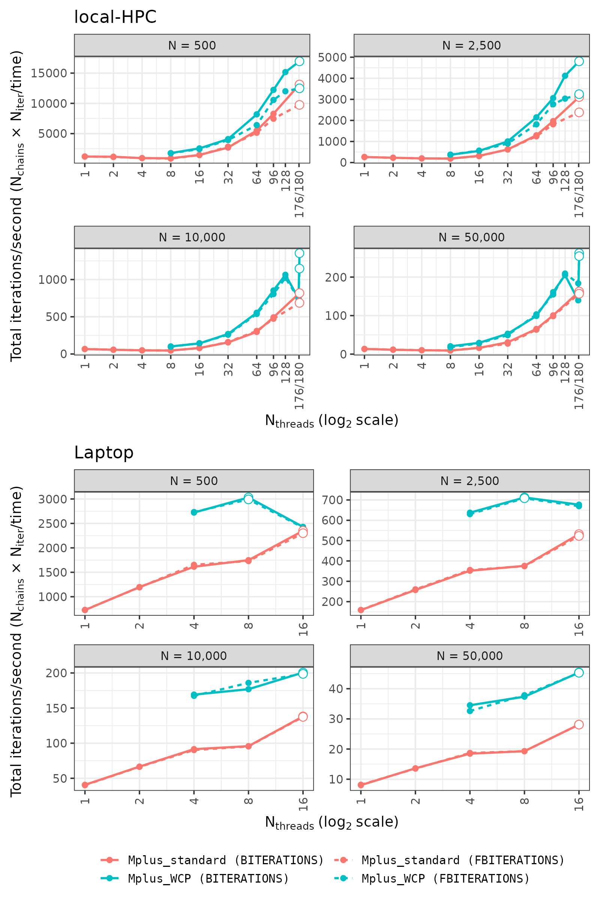

<!-- ----------------------------------------------------------------------------------------------------------------------------- -->
# Online appendix: Mplus "BITERATIONS" vs. "FBITERATIONS"
<!-- ----------------------------------------------------------------------------------------------------------------------------- -->

Online appendix of the paper "Cache-based chunking dramatically improves parallel scaling for HMC, for autodiff and manual gradients: Application to multivariate probit in Stan and NicoStan/BayesMVP".
It gives the details of the two iteration-control settings of Mplus (`BITERATIONS` and `FBITERATIONS`), and of our comparison of them in experiment 1 (E1).
Section and equation numbers refer to the paper.

Note that, in the paper, Mplus used `BITERATIONS` in E1, E2 and E4, and `FBITERATIONS` in E3 (see section 4 below for the reasons).

## 1. The two iteration-control settings

Mplus (Muthén and Muthén, 1998-2017) has two iteration-control settings:

- (i) `BITERATIONS`: the requested number of iterations is an upper limit, since Mplus stops the chains early once its convergence criterion (`BCONVERGENCE`) is met; hence, we set `BCONVERGENCE=0` (i.e., never met).

- (ii) `FBITERATIONS`: the requested number of iterations is fixed (i.e., there is no convergence check); however, Mplus 8.10 (the version which we used) only runs whole blocks of 100 iterations (i.e., $100 \cdot \lfloor N_{\text{iter}}/100 \rfloor$ iterations per chain, and at least 100, with one exception; for the numbers of iterations which Mplus actually ran, see section 3 below).

We tested both settings in E1 since, for the same $N_{\text{iter}}$, they do not necessarily lead to the same run time (e.g., if one setting involves additional computations); the results (see section 3 below) helped us determine which setting to use for the cross-algorithm/software comparison (E2; see section 4.2 of the paper).

More specifically, in E1, every Mplus configuration (i.e., `Mplus_standard` and `Mplus_WCP`, at every allocation $N_{\text{chains}} \times N_{\text{threads/chain}}$ and $N$) was run with both settings, on both machines, with three repeats per setting.
Each timed run was paired with an overhead run of one requested iteration (see equation 4 and section 3.1.5 of the paper), which always used `BITERATIONS`, since `FBITERATIONS` cannot run fewer than 100 iterations.

## 2. The prior-posterior predictive p-value (PPPP) computation

When the number of processors equals the number of chains (i.e., `PROCESSORS` = `CHAINS`, as in `Mplus_standard`), Mplus - by default - runs as many iterations again for computing the prior-posterior predictive p-value (PPPP) as it runs for the model estimation, with both iteration settings; in other words, the PPPP iterations take up about half of each run.
However, with `BITERATIONS`, Mplus then reports that "THE PPPP COULD NOT BE COMPUTED"; hence, the PPPP value itself is only given for the `FBITERATIONS` runs of `Mplus_standard`.
On the other hand, when the number of processors exceeds the number of chains (i.e., `PROCESSORS` > `CHAINS`, as in `Mplus_WCP`), Mplus skips the PPPP computation entirely (with a warning that the PPPP is only available when the number of processors does not exceed the number of chains).
We checked all of this using Mplus 8.10 (i.e., the version used throughout the paper), with the single-population LC-MVP model used in E1, $N = 500$, $N_{\text{chains}} = 4$ (with `PROCESSORS` = 4 and 8) and 10,000 iterations, under both iteration settings.

Note that all of the Mplus timings in the paper are as Mplus runs them; we did not adjust any of them.
Hence, the times of `Mplus_standard` include the PPPP iterations with both settings (including in E2, which uses `BITERATIONS`), whereas those of `Mplus_WCP` do not.

## 3. Results: `BITERATIONS` vs. `FBITERATIONS`

Figure A1 shows the within-Mplus throughput (i.e., total iterations/second) of `Mplus_standard` and `Mplus_WCP` at each $N$, on both machines and with both iteration modes (the figure in section 3.2.5 of the paper shows the `BITERATIONS` lines only).

*Figure A1: Within-Mplus throughput (i.e., total iterations/second), for `Mplus_standard` and `Mplus_WCP`, with `BITERATIONS` (solid lines) and `FBITERATIONS` (dashed lines). Each panel compares the two configurations at the same dataset size ($N$) and device. Outlined/hollow points indicate the best observed throughput for each configuration and mode. Each `Mplus_WCP` point is the fastest allocation ($N_{\text{chains}} \times N_{\text{threads/chain}}$) at that $N_{\text{threads}}$ (with `BITERATIONS`, the allocation used in E2; bold in table A1). Note that, on the local-HPC, the `Mplus_WCP` points at $N_{\text{threads}} = 176$ share the "176/180" x-axis tick-mark.*

Table A1 shows the ratio of the time per iteration with `FBITERATIONS` to that with `BITERATIONS` (i.e., a ratio $> 1$ means that `FBITERATIONS` was slower, and a ratio $< 1$ that it was faster).
On the local-HPC, the median difference between the two Mplus modes was generally modest.
However, at $N_{\text{threads}} = 180$ (i.e., at full load), `FBITERATIONS` was $18\% - 48\%$ slower at $N \le 10{,}000$, but only $3\% - 4\%$ slower at $N = 50{,}000$ (see the $180 \times 1$ and $90 \times 2$ rows of table A1, and the dashed lines in figure A1).
On the other hand, on the laptop (see the bottom of table A1), the median ratios were closer to one ($0.996 - 1.009$).

**Table A1.** Within-Mplus adjusted-time ratio, `FBITERATIONS`/`BITERATIONS` (i.e., the time per iteration with `FBITERATIONS` divided by that with `BITERATIONS`), for each device, allocation ($N_{\text{chains}} \times N_{\text{threads/chain}}$) and $N$ (each the mean of three repeats per mode; see section 3.1.5 of the paper); a ratio $> 1$ means that `FBITERATIONS` was slower, and a ratio $< 1$ that it was faster.
Allocations with $N_{\text{threads/chain}} = 1$ are `Mplus_standard`, and those with $N_{\text{threads/chain}} \ge 2$ are `Mplus_WCP`; each median is across the allocations of its block, and hyphens mark allocations which were not run at that $N$.
Bold marks the `Mplus_WCP` allocation which we used in E2 at each $N_{\text{threads}}$ (i.e., the fastest with `BITERATIONS`; see section 3.1.2 of the paper).
On the local-HPC at $N = 10{,}000$ with $N_{\text{threads}} = 16$, $8 \times 2$ was within $0.8\%$ of the bold $4 \times 4$ (i.e., essentially tied).

| Device | $N_{\text{chains}} \times N_{\text{threads/chain}}$ | $N = 500$ | $N = 2500$ | $N = 10{,}000$ | $N = 50{,}000$ |
|---|---|---:|---:|---:|---:|
| local-HPC | $1 \times 1$ | 0.999 | 1.019 | 0.994 | 1.014 |
| | $2 \times 1$ | 1.027 | 0.994 | 0.984 | 0.957 |
| | $4 \times 1$ | 0.989 | 1.026 | 1.015 | 1.006 |
| | $8 \times 1$ | 1.062 | 0.991 | 0.995 | 0.998 |
| | $16 \times 1$ | 1.016 | 1.044 | 1.014 | 0.977 |
| | $32 \times 1$ | 0.946 | 0.992 | 0.970 | 1.128 |
| | $64 \times 1$ | 1.070 | 1.039 | 0.957 | 1.029 |
| | $96 \times 1$ | 1.109 | 1.084 | 1.040 | 1.021 |
| | $180 \times 1$ | 1.346 | 1.306 | 1.191 | 1.035 |
| | Median (standard) | 1.027 | 1.026 | 0.995 | 1.014 |
| | $4 \times 2$ | **1.017** | **0.981** | **1.042** | **1.157** |
| | $4 \times 4$ | 1.027 | 0.957 | **0.977** | **1.042** |
| | $4 \times 8$ | 1.045 | 1.107 | 1.092 | 0.989 |
| | $4 \times 16$ | - | - | 1.163 | 1.048 |
| | $4 \times 24$ | - | - | 0.982 | 1.039 |
| | $4 \times 32$ | - | - | 1.176 | 1.072 |
| | $4 \times 44$ | - | - | 1.092 | **0.761** |
| | $8 \times 2$ | **1.095** | **1.016** | 1.021 | 1.020 |
| | $8 \times 4$ | 1.053 | 1.082 | 1.069 | 1.039 |
| | $8 \times 8$ | 1.090 | 1.079 | 0.921 | 0.945 |
| | $8 \times 12$ | - | - | 1.083 | 1.010 |
| | $8 \times 16$ | - | - | 1.132 | 1.062 |
| | $8 \times 22$ | - | - | **1.135** | 1.044 |
| | $16 \times 2$ | **1.040** | **1.114** | **1.039** | **1.087** |
| | $16 \times 4$ | 1.091 | 1.073 | 0.958 | 0.938 |
| | $16 \times 6$ | 1.054 | 1.009 | 0.891 | 1.012 |
| | $16 \times 8$ | 1.090 | 1.063 | 1.064 | 0.969 |
| | $16 \times 11$ | - | - | 0.934 | 0.940 |
| | $32 \times 2$ | **1.277** | **1.183** | **1.030** | **0.960** |
| | $48 \times 2$ | **1.158** | **1.106** | **1.060** | **1.039** |
| | $64 \times 2$ | **1.264** | **1.358** | **1.040** | **0.980** |
| | $90 \times 2$ | **1.358** | **1.480** | **1.180** | **1.030** |
| | Median (WCP) | 1.090 | 1.080 | 1.051 | 1.025 |
| Laptop | $1 \times 1$ | 0.994 | 0.996 | 1.012 | 0.984 |
| | $2 \times 1$ | 1.004 | 0.989 | 1.004 | 1.007 |
| | $4 \times 1$ | 0.977 | 0.990 | 1.014 | 0.987 |
| | $8 \times 1$ | 1.010 | 1.004 | 1.004 | 1.000 |
| | $16 \times 1$ | 1.021 | 1.017 | 1.005 | 1.000 |
| | Median (standard) | 1.004 | 0.996 | 1.005 | 1.000 |
| | $2 \times 2$ | **0.996** | **1.011** | **1.010** | **1.059** |
| | $2 \times 4$ | 1.002 | 1.004 | **0.999** | 1.002 |
| | $2 \times 8$ | 0.947 | 0.982 | 1.025 | 1.030 |
| | $4 \times 2$ | **1.013** | **1.005** | 0.934 | **0.988** |
| | $4 \times 4$ | 1.015 | 1.079 | 1.008 | 0.997 |
| | $8 \times 2$ | **1.005** | **1.011** | **1.010** | **1.001** |
| | Median (WCP) | 1.004 | 1.008 | 1.009 | 1.002 |

Furthermore, `FBITERATIONS` returned exactly the requested $N_{\text{iter}}$ - except for the single-chain standard configuration at $N = 50{,}000$ - where 100 requested iterations produced 200 draws in all 3 repeats on both machines (since, with a single chain, Mplus runs at least 200 iterations, and $N = 50{,}000$ was the only $N$ at which fewer were requested [i.e., 100 iterations, vs. 2000, 400 and 200 iterations at $N = 500$, $2500$ and $10{,}000$, respectively; see the table of $N_{\text{iter}}$ in section 4.1 of the paper]; note that the timings use the number of iterations actually run, $n_l^{\mathrm{obs}}$; see equation 4 of the paper).

## 4. Why E1 and E2 used `BITERATIONS`, and E3 `FBITERATIONS`

For the cross-software/algorithm results in section 4.2 of the paper (E2), we used `BITERATIONS` for both Mplus configurations on both machines, since it returned exactly the requested $N_{\text{iter}}$ in every run, and was never meaningfully slower than `FBITERATIONS` (i.e., the median ratios were all $\ge 0.995$; see table A1), whilst also being much faster at full load on the local-HPC; in other words, this gives Mplus its faster mode.
The `Mplus_standard` vs. `Mplus_WCP` comparison in section 3.2.5 of the paper, and the hardware-counter profiling of `Mplus_standard` in E4 (section 6 of the paper), also use `BITERATIONS`.
For `Mplus_WCP` in E2, we used the fastest allocation at each $N_{\text{threads}}$ (bold in table A1), which was nearly always $N_{\text{threads/chain}} = 2$.

In contrast to E2, E3 uses `FBITERATIONS` (see section 5.1 of the paper), since `BITERATIONS` with `BCONVERGENCE=0` does not give proper convergence statistics, which a complete analysis needs.
Note that, had Mplus used `BITERATIONS` in E3, it would have been at most $1.35\times$, $1.31\times$, $1.19\times$ and $1.04\times$ faster on the local-HPC, from $N = 500$ to $N = 50{,}000$ (see the $180 \times 1$ row of table A1, for the single-population model), and approximately the same speed on the laptop (i.e., $1.00\times - 1.02\times$).

## References

- Muthén LK, Muthén BO (1998-2017). Mplus User's Guide (8th edition). https://www.statmodel.com/download/MplusUserGuideVer_8.pdf
